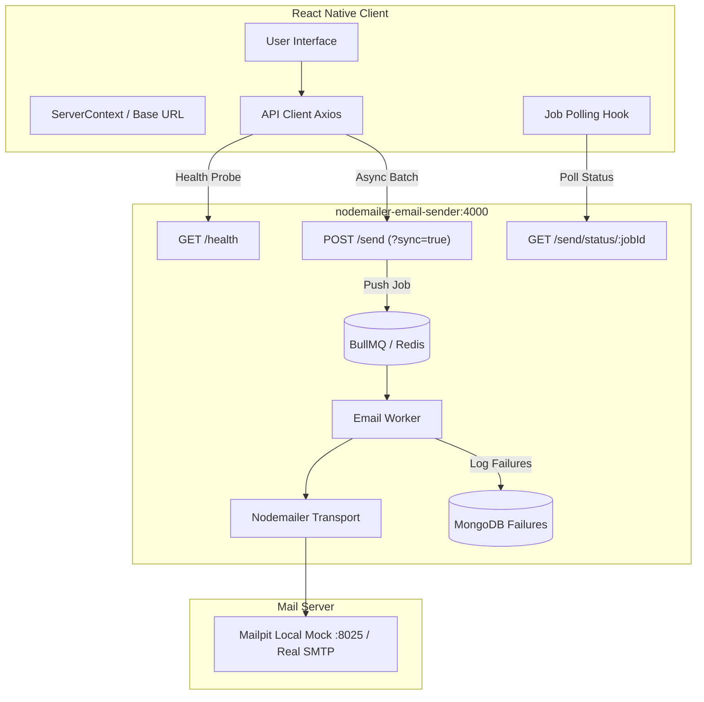

# Complete React Native Development Guide for `nodemailer-email-sender`

A comprehensive, production-grade guide for building a cross-platform **React Native (iOS & Android)** client application to interface with the `nodemailer-email-sender` backend service.

---

## Table of Contents

1. [System Architecture & Backend Understanding](#1-system-architecture--backend-understanding)
2. [Mobile Networking & Local Development Prerequisites](#2-mobile-networking--local-development-prerequisites)
   - [Platform-Specific Base URLs (Emulators vs. Physical Devices)](#platform-specific-base-urls)
   - [Android Cleartext HTTP Traffic Setup](#android-cleartext-http-traffic-setup)
   - [Testing Outgoing Emails Safely with Mailpit](#testing-outgoing-emails-safely-with-mailpit)
3. [Recommended React Native Tech Stack](#3-recommended-react-native-tech-stack)
4. [App Architecture & Screen Flow Blueprint](#4-app-architecture--screen-flow-blueprint)
5. [Step-by-Step Project Setup](#5-step-by-step-project-setup)
6. [API Service Layer Implementation (Ready-to-Use Code)](#6-api-service-layer-implementation)
   - [Dynamic Server URL Context & Storage](#server-context--url-manager)
   - [Axios HTTP Client with Interceptors](#axios-http-client)
   - [Email Service API Wrapper](#email-service-api-wrapper)
   - [BullMQ Job Polling Custom Hook (`useJobPoller`)](#bullmq-job-polling-custom-hook)
7. [Screen Implementations & UI Patterns](#7-screen-implementations--ui-patterns)
   - [Screen 1: Server Config & Health Dashboard](#screen-1-server-config--health-dashboard)
   - [Screen 2: Quick Job Application Sender (Zero-Payload Flow)](#screen-2-quick-job-application-sender)
   - [Screen 3: Custom Bulk Email Composer](#screen-3-custom-bulk-email-composer)
   - [Screen 4: Live Queue & Job Status Monitor](#screen-4-live-queue--job-status-monitor)
   - [Screen 5: Failure Audit & Delivery History](#screen-5-failure-audit--delivery-history)
8. [Data Validation & Error Handling Best Practices](#8-data-validation--error-handling-best-practices)
9. [Troubleshooting & Common Mobile Gotchas](#9-troubleshooting--common-mobile-gotchas)

---

## 1. System Architecture & Backend Understanding

The `nodemailer-email-sender` backend is an Express-based service optimized for individual or bulk email dispatches with pooled SMTP connections, BullMQ background job processing, and failure logging.



### Backend Endpoints Reference

| Method | Endpoint | Description | Expected Status | Response Summary |
|---|---|---|---|---|
| `GET` | `/health` | Process state + dependency probe | `200 OK` / `503` | `{"status": "ok", "uptimeSeconds": 412.5, "checks": {"mongo": {...}, "smtp": {...}, "redis": {...}}}` |
| `POST` | `/send` | Asynchronous queue dispatch (BullMQ) | `202 Accepted` | `{"ok": true, "jobId": "1", "total": 5, "statusUrl": "/send/status/1"}` |
| `POST` | `/send?sync=true` | Synchronous immediate dispatch | `200 OK` | `{"ok": true, "total": 2, "sent": 1, "failed": 1, "failures": [...]}` |
| `GET` | `/send/status/:jobId` | Query BullMQ background job state | `200 OK` / `404` / `503` | `{"ok": true, "state": "completed", "result": {...}}` |

### Recipient Payload Options

The mobile app can send the `emails` array in several formats:

1. **Zero-Payload (Strings only):**
   ```json
   {
     "emails": ["recruiter1@company.com", "recruiter2@company.com"]
   }
   ```
   *Behavior:* The server automatically populates `subject` from `data/subject.txt`, `html`/`text` from `data/body.txt`, and automatically attaches the PDF resume (`Samir_Shaikh_FullStack_Developer.pdf`).
2. **Custom Objects:**
   ```json
   {
     "emails": [
       {
         "to": "client@example.com",
         "subject": "Proposal Update",
         "html": "<p>Hello, please find the proposal attached.</p>",
         "text": "Hello, please find the proposal attached.",
         "attachPdf": false
       }
     ]
   }
   ```
3. **Mixed Arrays:** Allows mixing plain strings with customized recipient objects.

---

## 2. Mobile Networking & Local Development Prerequisites

### Platform-Specific Base URLs

When developing on a local machine, mobile devices and emulators route network traffic differently. **Never hardcode `http://localhost:4000`** in a React Native app.

| Device / Environment | Backend Base URL | Explanation |
|---|---|---|
| **Android Emulator (AVD)** | `http://10.0.2.2:4000` | The Android emulator uses `10.0.2.2` as an alias to the host machine's loopback interface (`localhost`). |
| **iOS Simulator** | `http://localhost:4000` | Shares the host machine network namespace directly. |
| **Physical Device (via Wi-Fi)** | `http://<YOUR_LOCAL_IP>:4000` | Both computer and phone must be on the same Wi-Fi network (e.g., `http://192.168.1.150:4000`). Find your IP with `ipconfig` (Windows) or `ifconfig` (macOS/Linux). |
| **Physical Device (Tunnels)** | `https://xxxx.ngrok-free.app` | Use `npx ngrok http 4000` or Cloudflare Tunnel to expose local backend over public HTTPS. |
| **Production Server** | `https://<your-service>.onrender.com` | Deployed backend on Render, AWS, Railway, etc. |

### Android Cleartext HTTP Traffic Setup

By default, Android 9 (API level 28) and higher block plain unencrypted HTTP (`http://`) traffic. To allow local development against `http://`:

#### For Expo (`app.json`):
```json
{
  "expo": {
    "name": "EmailSenderApp",
    "slug": "email-sender-app",
    "android": {
      "usesCleartextTraffic": true
    }
  }
}
```

#### For Bare React Native CLI (`android/app/src/main/AndroidManifest.xml`):
```xml
<application
  android:name=".MainApplication"
  android:label="@string/app_name"
  android:icon="@mipmap/ic_launcher"
  android:roundIcon="@mipmap/ic_launcher_round"
  android:allowBackup="false"
  android:theme="@style/AppTheme"
  android:usesCleartextTraffic="true">
  <!-- ... -->
</application>
```

### Testing Outgoing Emails Safely with Mailpit

When developing locally with Docker (`npm run docker:up` in this repository):
- The app sends emails through the local SMTP mock on port `1025`.
- Open **Mailpit Web UI** at `http://localhost:8025` (or `http://<YOUR_LOCAL_IP>:8025` on mobile browser) to view, inspect, and verify all delivered emails and PDF attachments safely without spamming real inboxes.

---

## 3. Recommended React Native Tech Stack

| Responsibility | Recommended Tool | Rationale |
|---|---|---|
| **Framework** | **Expo (SDK 51+)** | Rapid setup, excellent tooling, easy device testing via Expo Go, seamless OTA updates. |
| **Navigation** | **React Navigation v6** (`@react-navigation/native`, `bottom-tabs`, `stack`) | Industry standard mobile navigation with native gesture support. |
| **HTTP Client** | **Axios** | Simple interceptors, unified error handling, timeout configuration, and cancellation support. |
| **Local Persistence** | **AsyncStorage** (`@react-native-async-storage/async-storage`) | Caching configured server URL, recent email history, and favorite templates. |
| **Icons & UI** | **Lucide Icons** (`lucide-react-native`) + **Tailwind (NativeWind v4)** or **StyleSheet** | Modern, clean aesthetic with responsive layout tokens and smooth interactions. |
| **Device Feedback** | **Expo Haptics** (`expo-haptics`) | Subtle tactile feedback on send, success, and error states. |

---

## 4. App Architecture & Screen Flow Blueprint

```
App Navigation Root
├── Bottom Tab Navigator
│   ├── Tab 1: "Quick Send" (Recruiter & Job Application 1-Tap Delivery)
│   ├── Tab 2: "Compose" (Full Bulk Email Studio)
│   ├── Tab 3: "Queue Monitor" (Active & Recent BullMQ Jobs)
│   ├── Tab 4: "Delivery Audit" (Delivery logs, failed recipient drill-down)
│   └── Tab 5: "Settings & Health" (Server URL switcher, ping test, Mailpit link)
└── Stack Modals
    ├── JobDetailsModal (Shows real-time progress & error breakdown of a specific jobId)
    └── RecipientListModal (Paste, parse & preview recipient chips)
```

---

## 5. Step-by-Step Project Setup

Run the following commands in your chosen workspace directory to create the companion React Native app:

```bash
# 1. Initialize modern Expo project
npx create-expo-app@latest EmailSenderMobile --template blank
cd EmailSenderMobile

# 2. Install core navigation packages
npm install @react-navigation/native @react-navigation/bottom-tabs @react-navigation/native-stack
npx expo install react-native-screens react-native-safe-area-context

# 3. Install networking, storage, icons & haptics
npm install axios @react-native-async-storage/async-storage lucide-react-native
npx expo install expo-haptics expo-clipboard

# 4. Optional: Install NativeWind for Tailwind styling (or use StyleSheet)
npm install nativewind@^4.0.1 react-native-reanimated
```

### Recommended Directory Structure

```
EmailSenderMobile/
├── App.js
├── app.json
├── package.json
└── src/
    ├── api/
    │   ├── client.js          # Axios instance with baseURL and error handling
    │   └── emailService.js    # /health, /send, /send/status API calls
    ├── context/
    │   └── ServerContext.js   # Dynamic base URL management & active connection state
    ├── hooks/
    │   ├── useServerHealth.js # Health probe hook with auto-check
    │   └── useJobPoller.js    # BullMQ job status polling hook
    ├── screens/
    │   ├── QuickSendScreen.js
    │   ├── ComposeScreen.js
    │   ├── QueueMonitorScreen.js
    │   ├── DeliveryAuditScreen.js
    │   └── SettingsScreen.js
    ├── components/
    │   ├── StatusBadge.js
    │   ├── EmailChipsInput.js
    │   ├── JobCard.js
    │   └── FailureListModal.js
    └── utils/
        ├── storage.js         # AsyncStorage helper for recent sends
        └── validators.js      # Email regex & input sanitization
```

---

## 6. API Service Layer Implementation

### Server Context & URL Manager

Save in `src/context/ServerContext.js`. This allows changing the server URL on the fly (e.g., toggling between Android emulator `10.0.2.2`, physical LAN IP, or Render production) without rebuilding the app.

```javascript
import React, { createContext, useContext, useState, useEffect } from "react";
import { Platform } from "react-native";
import AsyncStorage from "@react-native-async-storage/async-storage";
import { checkServerHealth } from "../api/emailService";

const STORAGE_KEY = "@email_sender_base_url";

const DEFAULT_URL = Platform.select({
  android: "http://10.0.2.2:4000",
  ios: "http://localhost:4000",
  default: "http://localhost:4000",
});

const ServerContext = createContext(null);

export const ServerProvider = ({ children }) => {
  const [baseUrl, setBaseUrlState] = useState(DEFAULT_URL);
  const [isConnected, setIsConnected] = useState(false);
  const [isChecking, setIsChecking] = useState(false);

  useEffect(() => {
    (async () => {
      const saved = await AsyncStorage.getItem(STORAGE_KEY);
      if (saved) setBaseUrlState(saved);
      probeConnection(saved || DEFAULT_URL);
    })();
  }, []);

  const updateBaseUrl = async (url) => {
    const sanitized = url.trim().replace(/\/+$/, ""); // remove trailing slash
    setBaseUrlState(sanitized);
    await AsyncStorage.setItem(STORAGE_KEY, sanitized);
    await probeConnection(sanitized);
  };

  const probeConnection = async (urlToTest) => {
    setIsChecking(true);
    try {
      const ok = await checkServerHealth(urlToTest || baseUrl);
      setIsConnected(ok);
    } catch {
      setIsConnected(false);
    } finally {
      setIsChecking(false);
    }
  };

  return (
    <ServerContext.Provider
      value={{
        baseUrl,
        updateBaseUrl,
        isConnected,
        isChecking,
        probeConnection,
        defaultUrl: DEFAULT_URL,
      }}
    >
      {children}
    </ServerContext.Provider>
  );
};

export const useServer = () => useContext(ServerContext);
```

---

### Axios HTTP Client

Save in `src/api/client.js`:

```javascript
import axios from "axios";

export const createApiClient = (baseURL) => {
  const instance = axios.create({
    baseURL,
    timeout: 15000, // 15 seconds timeout
    headers: {
      "Content-Type": "application/json",
    },
  });

  instance.interceptors.response.use(
    (response) => response,
    (error) => {
      // Normalize error message from backend
      const message =
        error.response?.data?.error ||
        error.message ||
        "Network connection failed. Check your server URL.";
      return Promise.reject(new Error(message));
    }
  );

  return instance;
};
```

---

### Email Service API Wrapper

Save in `src/api/emailService.js`:

```javascript
import axios from "axios";
import { createApiClient } from "./client";

/**
 * Checks backend health via GET /health.
 * Returns true only when the process is up AND every configured dependency is reachable.
 * The endpoint can take up to HEALTH_PROBE_TIMEOUT_MS (5000ms default) on a slow SMTP
 * auth, so the client timeout must sit above that.
 */
export const checkServerHealth = async (baseUrl) => {
  try {
    const res = await axios.get(`${baseUrl}/health`, { timeout: 8000 });
    return res.data?.status === "ok";
  } catch {
    // A 503 lands here too. Inspect the body to tell "process down" from
    // "dependency down": res.response?.data?.checks
    return false;
  }
};

/**
 * Dispatches an email batch
 * @param {string} baseUrl - Active backend root
 * @param {Array<string|object>} emails - Array of recipients
 * @param {boolean} isSync - If true, passes ?sync=true to bypass BullMQ
 */
export const sendEmailsApi = async (baseUrl, emails, isSync = false) => {
  const client = createApiClient(baseUrl);
  const url = isSync ? "/send?sync=true" : "/send";
  const res = await client.post(url, { emails });
  return res.data;
};

/**
 * Fetches status of a background job via GET /send/status/:jobId
 */
export const getJobStatusApi = async (baseUrl, jobId) => {
  const client = createApiClient(baseUrl);
  const res = await client.get(`/send/status/${jobId}`);
  return res.data;
};
```

---

### BullMQ Job Polling Custom Hook

Save in `src/hooks/useJobPoller.js`. This handles polling the `/send/status/:jobId` endpoint with automatic cleanup when the job finishes (`completed` or `failed`) or when the screen unmounts.

```javascript
import { useState, useEffect, useRef } from "react";
import { getJobStatusApi } from "../api/emailService";

export const useJobPoller = (baseUrl, jobId, options = { interval: 2000, enabled: true }) => {
  const [jobData, setJobData] = useState(null);
  const [isPolling, setIsPolling] = useState(false);
  const [error, setError] = useState(null);
  const timerRef = useRef(null);

  useEffect(() => {
    if (!jobId || !options.enabled) return;

    let isMounted = true;
    setIsPolling(true);
    setError(null);

    const poll = async () => {
      try {
        const data = await getJobStatusApi(baseUrl, jobId);
        if (!isMounted) return;

        setJobData(data);

        // Stop polling if completed or failed
        if (data.state === "completed" || data.state === "failed") {
          setIsPolling(false);
          return;
        }

        // Schedule next poll
        timerRef.current = setTimeout(poll, options.interval);
      } catch (err) {
        if (!isMounted) return;
        setError(err.message);
        setIsPolling(false);
      }
    };

    poll();

    return () => {
      isMounted = false;
      if (timerRef.current) clearTimeout(timerRef.current);
    };
  }, [baseUrl, jobId, options.enabled, options.interval]);

  return { jobData, isPolling, error };
};
```

---

## 7. Screen Implementations & UI Patterns

### Screen 1: Server Config & Health Dashboard

**Location:** `src/screens/SettingsScreen.js`
Allows entering IP, selecting quick presets, pinging the server, and opening Mailpit.

```javascript
import React, { useState } from "react";
import {
  View,
  Text,
  TextInput,
  TouchableOpacity,
  StyleSheet,
  ActivityIndicator,
  Linking,
  ScrollView,
} from "react-native";
import { useServer } from "../context/ServerContext";

export const SettingsScreen = () => {
  const { baseUrl, updateBaseUrl, isConnected, isChecking, probeConnection, defaultUrl } = useServer();
  const [inputUrl, setInputUrl] = useState(baseUrl);
  const [statusMsg, setStatusMsg] = useState("");

  const handleSaveAndTest = async () => {
    setStatusMsg("Pinging server...");
    await updateBaseUrl(inputUrl);
    setStatusMsg(isConnected ? "Connected successfully!" : "Could not reach server.");
  };

  const openMailpit = () => {
    try {
      const parsed = new URL(baseUrl);
      const mailpitUrl = `http://${parsed.hostname}:8025`;
      Linking.openURL(mailpitUrl);
    } catch {
      Linking.openURL("http://localhost:8025");
    }
  };

  return (
    <ScrollView contentContainerStyle={styles.container}>
      <Text style={styles.header}>Backend Configuration</Text>
      <Text style={styles.subtext}>
        Specify the HTTP address where your nodemailer-email-sender instance is listening.
      </Text>

      {/* Connection Status Card */}
      <View style={[styles.statusCard, isConnected ? styles.bgSuccess : styles.bgDanger]}>
        <View style={[styles.dot, isConnected ? styles.dotGreen : styles.dotRed]} />
        <Text style={styles.statusText}>
          {isChecking ? "Checking status..." : isConnected ? "Online & Healthy" : "Offline / Unreachable"}
        </Text>
      </View>

      {/* URL Input */}
      <Text style={styles.label}>Backend Base URL</Text>
      <TextInput
        style={styles.input}
        value={inputUrl}
        onChangeText={setInputUrl}
        placeholder="http://10.0.2.2:4000"
        autoCapitalize="none"
        autoCorrect={false}
      />

      {/* Preset Buttons */}
      <Text style={styles.presetLabel}>Quick Presets:</Text>
      <View style={styles.presetRow}>
        <TouchableOpacity
          style={styles.presetBtn}
          onPress={() => setInputUrl("http://10.0.2.2:4000")}
        >
          <Text style={styles.presetBtnText}>Android Emulator</Text>
        </TouchableOpacity>
        <TouchableOpacity
          style={styles.presetBtn}
          onPress={() => setInputUrl("http://localhost:4000")}
        >
          <Text style={styles.presetBtnText}>iOS Simulator</Text>
        </TouchableOpacity>
      </View>

      {/* Action Buttons */}
      <TouchableOpacity style={styles.primaryBtn} onPress={handleSaveAndTest} disabled={isChecking}>
        {isChecking ? (
          <ActivityIndicator color="#fff" />
        ) : (
          <Text style={styles.primaryBtnText}>Test & Save Connection</Text>
        )}
      </TouchableOpacity>

      <TouchableOpacity style={styles.mailpitBtn} onPress={openMailpit}>
        <Text style={styles.mailpitBtnText}>Open Mailpit Web UI (:8025)</Text>
      </TouchableOpacity>

      {statusMsg ? <Text style={styles.feedback}>{statusMsg}</Text> : null}
    </ScrollView>
  );
};

const styles = StyleSheet.create({
  container: { padding: 20, backgroundColor: "#0f172a", flexGrow: 1 },
  header: { fontSize: 24, fontWeight: "700", color: "#f8fafc", marginBottom: 6 },
  subtext: { fontSize: 14, color: "#94a3b8", marginBottom: 20 },
  statusCard: { flexDirection: "row", alignItems: "center", padding: 14, borderRadius: 10, marginBottom: 20 },
  bgSuccess: { backgroundColor: "rgba(34, 197, 94, 0.15)", borderWidth: 1, borderColor: "#22c55e" },
  bgDanger: { backgroundColor: "rgba(239, 68, 68, 0.15)", borderWidth: 1, borderColor: "#ef4444" },
  dot: { width: 10, height: 10, borderRadius: 5, marginRight: 10 },
  dotGreen: { backgroundColor: "#22c55e" },
  dotRed: { backgroundColor: "#ef4444" },
  statusText: { color: "#f8fafc", fontWeight: "600", fontSize: 15 },
  label: { color: "#cbd5e1", fontSize: 14, fontWeight: "600", marginBottom: 8 },
  input: { backgroundColor: "#1e293b", borderWidth: 1, borderColor: "#334155", color: "#f8fafc", borderRadius: 8, padding: 12, fontSize: 16, marginBottom: 14 },
  presetLabel: { color: "#64748b", fontSize: 12, marginBottom: 8, textTransform: "uppercase" },
  presetRow: { flexDirection: "row", gap: 10, marginBottom: 20 },
  presetBtn: { backgroundColor: "#1e293b", paddingVertical: 8, paddingHorizontal: 12, borderRadius: 6, borderWidth: 1, borderColor: "#475569" },
  presetBtnText: { color: "#94a3b8", fontSize: 13 },
  primaryBtn: { backgroundColor: "#3b82f6", padding: 15, borderRadius: 8, alignItems: "center", marginBottom: 12 },
  primaryBtnText: { color: "#ffffff", fontWeight: "700", fontSize: 16 },
  mailpitBtn: { backgroundColor: "#334155", padding: 14, borderRadius: 8, alignItems: "center" },
  mailpitBtnText: { color: "#cbd5e1", fontWeight: "600" },
  feedback: { marginTop: 14, color: "#38bdf8", textAlign: "center" },
});
```

---

### Screen 2: Quick Job Application Sender (Zero-Payload Flow)

**Location:** `src/screens/QuickSendScreen.js`
Designed for applying to jobs in seconds! You enter one or multiple recruiter email addresses, tap Send, and the backend handles the rest:
- Cover letter from `data/body.txt`
- Subject from `data/subject.txt`
- PDF Resume automatically attached from `data/Samir_Shaikh_FullStack_Developer.pdf`

```javascript
import React, { useState } from "react";
import {
  View,
  Text,
  TextInput,
  TouchableOpacity,
  StyleSheet,
  Alert,
  ActivityIndicator,
  KeyboardAvoidingView,
  Platform,
  ScrollView,
} from "react-native";
import * as Haptics from "expo-haptics";
import { useServer } from "../context/ServerContext";
import { sendEmailsApi } from "../api/emailService";

export const QuickSendScreen = ({ navigation }) => {
  const { baseUrl, isConnected } = useServer();
  const [recipientInput, setRecipientInput] = useState("");
  const [loading, setLoading] = useState(false);

  const handleSend = async () => {
    // Parse emails separated by commas, spaces, or newlines
    const rawList = recipientInput
      .split(/[\s,]+/)
      .map((e) => e.trim())
      .filter((e) => e.length > 0);

    if (rawList.length === 0) {
      Alert.alert("Missing Recipient", "Please enter at least one valid email address.");
      return;
    }

    if (!isConnected) {
      Alert.alert("Server Offline", "Cannot dispatch emails. Check server URL in Settings.");
      return;
    }

    try {
      setLoading(true);
      // Zero-payload: sending string array triggers server templates & PDF resume
      const response = await sendEmailsApi(baseUrl, rawList, false);

      Haptics.notificationAsync(Haptics.NotificationFeedbackType.Success);
      Alert.alert(
        "Application Queued!",
        `Job ID #${response.jobId} created for ${rawList.length} recipient(s). Cover letter & PDF resume attached automatically.`,
        [
          {
            text: "Track Job",
            onPress: () => navigation.navigate("QueueMonitor", { jobId: response.jobId }),
          },
          { text: "Done", style: "cancel" },
        ]
      );
      setRecipientInput("");
    } catch (err) {
      Haptics.notificationAsync(Haptics.NotificationFeedbackType.Error);
      Alert.alert("Dispatch Failed", err.message);
    } finally {
      setLoading(false);
    }
  };

  return (
    <KeyboardAvoidingView
      behavior={Platform.OS === "ios" ? "padding" : "height"}
      style={styles.flex}
    >
      <ScrollView contentContainerStyle={styles.container}>
        <Text style={styles.title}>1-Tap Job Application</Text>
        <Text style={styles.subtitle}>
          Enter recruiter emails. The server automatically delivers your pre-configured cover letter
          (`body.txt`) and attaches your Resume PDF.
        </Text>

        <View style={styles.card}>
          <Text style={styles.cardLabel}>Recipients (one or multiple)</Text>
          <TextInput
            style={styles.textArea}
            multiline
            numberOfLines={4}
            placeholder="recruiter@tech.com, jobs@startup.io"
            placeholderTextColor="#64748b"
            value={recipientInput}
            onChangeText={setRecipientInput}
            autoCapitalize="none"
            autoCorrect={false}
            keyboardType="email-address"
          />
        </View>

        <View style={styles.infoBanner}>
          <Text style={styles.infoTitle}>Attached Assets (Server Side):</Text>
          <Text style={styles.infoItem}>📄 Samir_Shaikh_FullStack_Developer.pdf</Text>
          <Text style={styles.infoItem}>✉️ Live template loaded from data/body.txt</Text>
          <Text style={styles.infoItem}>⚡ Dispatched via async BullMQ queue</Text>
        </View>

        <TouchableOpacity
          style={[styles.sendButton, loading && styles.btnDisabled]}
          onPress={handleSend}
          disabled={loading}
        >
          {loading ? (
            <ActivityIndicator color="#ffffff" />
          ) : (
            <Text style={styles.sendButtonText}>Send Application(s)</Text>
          )}
        </TouchableOpacity>
      </ScrollView>
    </KeyboardAvoidingView>
  );
};

const styles = StyleSheet.create({
  flex: { flex: 1, backgroundColor: "#0f172a" },
  container: { padding: 20 },
  title: { fontSize: 24, fontWeight: "800", color: "#f8fafc", marginBottom: 6 },
  subtitle: { fontSize: 14, color: "#94a3b8", lineHeight: 20, marginBottom: 20 },
  card: { backgroundColor: "#1e293b", padding: 16, borderRadius: 12, marginBottom: 16 },
  cardLabel: { color: "#e2e8f0", fontSize: 14, fontWeight: "600", marginBottom: 10 },
  textArea: {
    backgroundColor: "#0f172a",
    color: "#f8fafc",
    padding: 12,
    borderRadius: 8,
    borderWidth: 1,
    borderColor: "#334155",
    height: 100,
    textAlignVertical: "top",
  },
  infoBanner: {
    backgroundColor: "rgba(59, 130, 246, 0.1)",
    borderWidth: 1,
    borderColor: "#1d4ed8",
    padding: 14,
    borderRadius: 10,
    marginBottom: 24,
  },
  infoTitle: { color: "#60a5fa", fontWeight: "700", marginBottom: 6, fontSize: 13 },
  infoItem: { color: "#93c5fd", fontSize: 13, marginBottom: 3 },
  sendButton: { backgroundColor: "#2563eb", padding: 16, borderRadius: 10, alignItems: "center" },
  btnDisabled: { opacity: 0.6 },
  sendButtonText: { color: "#fff", fontWeight: "700", fontSize: 16 },
});
```

---

### Screen 3: Custom Bulk Email Composer

**Location:** `src/screens/ComposeScreen.js`
Provides full control over recipient objects, subject, HTML content, attachment toggling (`attachPdf`), and choosing between **Background Queue (`202 Accepted`)** or **Instant Sync (`200 OK`)**.

```javascript
import React, { useState } from "react";
import {
  View,
  Text,
  TextInput,
  TouchableOpacity,
  Switch,
  ScrollView,
  StyleSheet,
  Alert,
  ActivityIndicator,
} from "react-native";
import { useServer } from "../context/ServerContext";
import { sendEmailsApi } from "../api/emailService";

export const ComposeScreen = ({ navigation }) => {
  const { baseUrl } = useServer();
  const [recipientsText, setRecipientsText] = useState("");
  const [subject, setSubject] = useState("");
  const [bodyHtml, setBodyHtml] = useState("");
  const [attachPdf, setAttachPdf] = useState(true);
  const [isSync, setIsSync] = useState(false);
  const [loading, setLoading] = useState(false);

  const handleSubmit = async () => {
    const list = recipientsText
      .split(/[\s,]+/)
      .map((e) => e.trim())
      .filter(Boolean);

    if (list.length === 0) {
      Alert.alert("Validation Error", "Please provide at least one recipient email.");
      return;
    }

    // Build array of custom email objects
    const emailsPayload = list.map((to) => ({
      to,
      subject: subject.trim() || undefined,
      html: bodyHtml.trim() ? `<p>${bodyHtml.replace(/\n/g, "<br/>")}</p>` : undefined,
      text: bodyHtml.trim() || undefined,
      attachPdf,
    }));

    try {
      setLoading(true);
      const res = await sendEmailsApi(baseUrl, emailsPayload, isSync);

      if (isSync) {
        // Synchronous Response format
        Alert.alert(
          "Dispatched (Sync)",
          `Total: ${res.total}\nSent: ${res.sent}\nFailed: ${res.failed}`,
          [{ text: "OK" }]
        );
      } else {
        // Asynchronous BullMQ Queue format
        Alert.alert(
          "Queued (Async BullMQ)",
          `Job ID: ${res.jobId}\nTotal recipients: ${res.total}`,
          [
            {
              text: "Monitor Job",
              onPress: () => navigation.navigate("QueueMonitor", { jobId: res.jobId }),
            },
            { text: "Dismiss" },
          ]
        );
      }
    } catch (err) {
      Alert.alert("Error", err.message);
    } finally {
      setLoading(false);
    }
  };

  return (
    <ScrollView style={styles.container} contentContainerStyle={styles.content}>
      <Text style={styles.title}>Compose Custom Batch</Text>

      <Text style={styles.label}>Recipients</Text>
      <TextInput
        style={styles.inputArea}
        placeholder="alex@example.com, sarah@company.com"
        placeholderTextColor="#64748b"
        value={recipientsText}
        onChangeText={setRecipientsText}
        multiline
      />

      <Text style={styles.label}>Subject (Leave empty to use server default)</Text>
      <TextInput
        style={styles.input}
        placeholder="Custom Subject Line"
        placeholderTextColor="#64748b"
        value={subject}
        onChangeText={setSubject}
      />

      <Text style={styles.label}>Message Body (HTML/Text)</Text>
      <TextInput
        style={[styles.inputArea, { height: 120 }]}
        placeholder="Write your email body here..."
        placeholderTextColor="#64748b"
        value={bodyHtml}
        onChangeText={setBodyHtml}
        multiline
      />

      {/* Options */}
      <View style={styles.optionRow}>
        <Text style={styles.optionText}>Attach Resume PDF (Samir_Shaikh...)</Text>
        <Switch value={attachPdf} onValueChange={setAttachPdf} trackColor={{ true: "#2563eb" }} />
      </View>

      <View style={styles.optionRow}>
        <View>
          <Text style={styles.optionText}>Synchronous Delivery Mode</Text>
          <Text style={styles.optionSub}>Bypasses Redis/BullMQ queue (?sync=true)</Text>
        </View>
        <Switch value={isSync} onValueChange={setIsSync} trackColor={{ true: "#10b981" }} />
      </View>

      <TouchableOpacity
        style={[styles.submitBtn, loading && { opacity: 0.7 }]}
        onPress={handleSubmit}
        disabled={loading}
      >
        {loading ? (
          <ActivityIndicator color="#fff" />
        ) : (
          <Text style={styles.submitBtnText}>
            {isSync ? "Send Immediately (Sync)" : "Enqueue Batch (BullMQ)"}
          </Text>
        )}
      </TouchableOpacity>
    </ScrollView>
  );
};

const styles = StyleSheet.create({
  container: { flex: 1, backgroundColor: "#0f172a" },
  content: { padding: 20 },
  title: { fontSize: 22, fontWeight: "700", color: "#f8fafc", marginBottom: 16 },
  label: { color: "#cbd5e1", fontSize: 13, fontWeight: "600", marginBottom: 6 },
  input: {
    backgroundColor: "#1e293b",
    color: "#f8fafc",
    borderRadius: 8,
    padding: 12,
    marginBottom: 16,
    borderWidth: 1,
    borderColor: "#334155",
  },
  inputArea: {
    backgroundColor: "#1e293b",
    color: "#f8fafc",
    borderRadius: 8,
    padding: 12,
    marginBottom: 16,
    height: 80,
    textAlignVertical: "top",
    borderWidth: 1,
    borderColor: "#334155",
  },
  optionRow: {
    flexDirection: "row",
    justifyContent: "space-between",
    alignItems: "center",
    backgroundColor: "#1e293b",
    padding: 14,
    borderRadius: 8,
    marginBottom: 12,
  },
  optionText: { color: "#f1f5f9", fontSize: 14, fontWeight: "600" },
  optionSub: { color: "#94a3b8", fontSize: 12, marginTop: 2 },
  submitBtn: {
    backgroundColor: "#2563eb",
    padding: 16,
    borderRadius: 10,
    alignItems: "center",
    marginTop: 10,
  },
  submitBtnText: { color: "#fff", fontWeight: "700", fontSize: 16 },
});
```

---

### Screen 4: Live Queue & Job Status Monitor

**Location:** `src/screens/QueueMonitorScreen.js`
Watches BullMQ jobs in real time with polling, visual progress bars, state indicators (`active`, `completed`, `failed`), and failure inspection.

```javascript
import React, { useState } from "react";
import {
  View,
  Text,
  TextInput,
  TouchableOpacity,
  StyleSheet,
  ActivityIndicator,
  FlatList,
} from "react-native";
import { useServer } from "../context/ServerContext";
import { useJobPoller } from "../hooks/useJobPoller";

export const QueueMonitorScreen = ({ route }) => {
  const { baseUrl } = useServer();
  const initialJobId = route.params?.jobId || "";
  const [jobId, setJobId] = useState(initialJobId);
  const [activeJobId, setActiveJobId] = useState(initialJobId);

  const { jobData, isPolling, error } = useJobPoller(baseUrl, activeJobId, {
    interval: 2000,
    enabled: Boolean(activeJobId),
  });

  const getBadgeStyle = (state) => {
    switch (state) {
      case "completed":
        return styles.badgeSuccess;
      case "active":
        return styles.badgeActive;
      case "failed":
        return styles.badgeFailed;
      default:
        return styles.badgeWaiting;
    }
  };

  return (
    <View style={styles.container}>
      <Text style={styles.header}>Queue & Job Monitor</Text>

      {/* Job Search / Input */}
      <View style={styles.searchRow}>
        <TextInput
          style={styles.input}
          placeholder="Enter BullMQ Job ID (e.g. 1)"
          placeholderTextColor="#64748b"
          value={jobId}
          onChangeText={setJobId}
          keyboardType="numeric"
        />
        <TouchableOpacity style={styles.trackBtn} onPress={() => setActiveJobId(jobId)}>
          <Text style={styles.trackBtnText}>Track</Text>
        </TouchableOpacity>
      </View>

      {error ? (
        <View style={styles.errorBox}>
          <Text style={styles.errorText}>Error: {error}</Text>
        </View>
      ) : null}

      {jobData ? (
        <View style={styles.card}>
          <View style={styles.cardHeader}>
            <Text style={styles.cardTitle}>Job #{jobData.jobId}</Text>
            <View style={[styles.badge, getBadgeStyle(jobData.state)]}>
              <Text style={styles.badgeText}>{jobData.state?.toUpperCase()}</Text>
            </View>
          </View>

          <Text style={styles.timestamp}>Queued at: {jobData.timestamp}</Text>
          <Text style={styles.info}>Attempts Made: {jobData.attemptsMade}</Text>

          {isPolling ? (
            <View style={styles.pollingIndicator}>
              <ActivityIndicator size="small" color="#38bdf8" />
              <Text style={styles.pollingText}>Worker processing in background...</Text>
            </View>
          ) : null}

          {jobData.result ? (
            <View style={styles.resultBox}>
              <Text style={styles.resultTitle}>Delivery Breakdown:</Text>
              <Text style={styles.statLine}>Total Recipients: {jobData.result.total}</Text>
              <Text style={[styles.statLine, { color: "#4ade80" }]}>
                Sent: {jobData.result.sent}
              </Text>
              <Text style={[styles.statLine, { color: "#f87171" }]}>
                Failed: {jobData.result.failed}
              </Text>

              {jobData.result.failures?.length > 0 ? (
                <View style={styles.failuresBox}>
                  <Text style={styles.failureHeading}>Failed Recipients:</Text>
                  {jobData.result.failures.map((f, i) => (
                    <View key={i} style={styles.failureItem}>
                      <Text style={styles.failureEmail}>{f.email}</Text>
                      <Text style={styles.failureReason}>[{f.reason}] {f.error}</Text>
                    </View>
                  ))}
                </View>
              ) : null}
            </View>
          ) : null}

          {jobData.failedReason ? (
            <View style={styles.fatalBox}>
              <Text style={styles.fatalTitle}>Job Failure Reason:</Text>
              <Text style={styles.fatalText}>{jobData.failedReason}</Text>
            </View>
          ) : null}
        </View>
      ) : activeJobId ? (
        <ActivityIndicator style={{ marginTop: 40 }} color="#38bdf8" />
      ) : (
        <Text style={styles.emptyText}>Enter a Job ID above to inspect its real-time queue state.</Text>
      )}
    </View>
  );
};

const styles = StyleSheet.create({
  container: { flex: 1, backgroundColor: "#0f172a", padding: 20 },
  header: { fontSize: 22, fontWeight: "700", color: "#f8fafc", marginBottom: 16 },
  searchRow: { flexDirection: "row", gap: 10, marginBottom: 20 },
  input: {
    flex: 1,
    backgroundColor: "#1e293b",
    color: "#f8fafc",
    borderRadius: 8,
    paddingHorizontal: 14,
    borderWidth: 1,
    borderColor: "#334155",
  },
  trackBtn: { backgroundColor: "#3b82f6", paddingHorizontal: 18, justifyContent: "center", borderRadius: 8 },
  trackBtnText: { color: "#fff", fontWeight: "700" },
  card: { backgroundColor: "#1e293b", padding: 18, borderRadius: 12 },
  cardHeader: { flexDirection: "row", justifyContent: "space-between", alignItems: "center", marginBottom: 10 },
  cardTitle: { fontSize: 18, fontWeight: "700", color: "#f8fafc" },
  badge: { paddingHorizontal: 10, paddingVertical: 4, borderRadius: 6 },
  badgeSuccess: { backgroundColor: "#15803d" },
  badgeActive: { backgroundColor: "#0369a1" },
  badgeFailed: { backgroundColor: "#b91c1c" },
  badgeWaiting: { backgroundColor: "#b45309" },
  badgeText: { color: "#fff", fontSize: 11, fontWeight: "800" },
  timestamp: { color: "#94a3b8", fontSize: 12, marginBottom: 4 },
  info: { color: "#cbd5e1", fontSize: 13, marginBottom: 12 },
  pollingIndicator: { flexDirection: "row", alignItems: "center", gap: 8, marginVertical: 10 },
  pollingText: { color: "#38bdf8", fontSize: 13 },
  resultBox: { marginTop: 12, padding: 12, backgroundColor: "#0f172a", borderRadius: 8 },
  resultTitle: { color: "#f8fafc", fontWeight: "700", marginBottom: 6 },
  statLine: { color: "#cbd5e1", fontSize: 14, marginBottom: 3 },
  failuresBox: { marginTop: 10, borderTopWidth: 1, borderTopColor: "#334155", paddingTop: 8 },
  failureHeading: { color: "#f87171", fontWeight: "700", marginBottom: 6, fontSize: 12 },
  failureItem: { marginBottom: 6 },
  failureEmail: { color: "#fca5a5", fontSize: 13, fontWeight: "600" },
  failureReason: { color: "#94a3b8", fontSize: 12 },
  fatalBox: { marginTop: 12, backgroundColor: "rgba(239, 68, 68, 0.15)", padding: 10, borderRadius: 6 },
  fatalTitle: { color: "#ef4444", fontWeight: "700", fontSize: 13 },
  fatalText: { color: "#fca5a5", fontSize: 12 },
  errorBox: { backgroundColor: "#7f1d1d", padding: 12, borderRadius: 8, marginBottom: 16 },
  errorText: { color: "#fecaca" },
  emptyText: { color: "#64748b", textAlign: "center", marginTop: 40 },
});
```

---

### Screen 5: Failure Audit & Delivery History

**Location:** `src/screens/DeliveryAuditScreen.js`
This screen reads historical failure reasons persisted in local storage or retrieved via synced jobs. It classifies errors matching the backend's `classifyError()` function:

| Error Key | Display Name | Recommended UX Action |
|---|---|---|
| `auth_failed` | **SMTP Authentication Error** | Show warning: *"Check server `.env` SMTP_USER / SMTP_PASS"*. |
| `dns_error` | **Host Resolution Failed** | Show warning: *"Cannot resolve SMTP Host. Check network connection."* |
| `invalid_address` | **Malformed Recipient Address** | Prompt user to edit/fix the typos in recipient emails. |
| `smtp_error` | **Mail Server Error** | Mailbox full, rate limit reached, or connection terminated. |

---

## 8. Data Validation & Error Handling Best Practices

### 1. Recipient List Normalization (Client Side)
Before hitting `POST /send`, validate inputs client-side to prevent unnecessary round trips:
```javascript
const EMAIL_REGEX = /^[^\s@]+@[^\s@]+\.[^\s@]+$/;

export const parseAndValidateRecipients = (rawText) => {
  const tokens = rawText.split(/[\s,;]+/).map((t) => t.trim()).filter(Boolean);
  const valid = [];
  const invalid = [];

  tokens.forEach((email) => {
    if (EMAIL_REGEX.test(email)) {
      valid.push(email);
    } else {
      invalid.push(email);
    }
  });

  return { valid, invalid };
};
```

### 2. Handling HTTP Status Codes Accurately
- **`200 OK`**: Received when in sync mode (`?sync=true`). Check `response.data.failed > 0` to see if partial failures occurred.
- **`202 Accepted`**: Received when queued in BullMQ. Store `response.data.jobId` in local storage or navigation params.
- **`400 Bad Request`**: Malformed JSON or empty `emails` array. Display `error.response.data.error`.
- **`404 Not Found`**: Invalid job ID or unknown route.
- **`503 Service Unavailable`**: BullMQ/Redis not running on server when polling `/send/status/:jobId`. Also returned by `GET /health` when a *required* dependency is down — read `response.data.checks` to see which one.

---

## 9. Troubleshooting & Common Mobile Gotchas

### Issue 1: `Network Error` or `TypeError: Network request failed`
- **Cause:** Android device or emulator cannot reach `localhost`.
- **Solution:** For Android Emulator, use `http://10.0.2.2:4000`. For physical phones, use `http://<YOUR_COMPUTER_LAN_IP>:4000`.

### Issue 2: `ERR_CLEARTEXT_NOT_PERMITTED` on Android
- **Cause:** Android prevents plain HTTP calls unless permitted.
- **Solution:** Add `"android": { "usesCleartextTraffic": true }` to `app.json` in Expo, or `android:usesCleartextTraffic="true"` to `AndroidManifest.xml`.

### Issue 3: Job status returns `503 Service Unavailable`
- **Cause:** BullMQ background queue is only active when `REDIS_URL` is set in the backend's `.env`.
- **Solution:** Ensure Redis container is running (`docker compose up -d redis`) or run `POST /send?sync=true` if Redis is unconfigured.

### Issue 4: Health check reports the server as "offline" while it is clearly up
- **Cause:** `GET /health` probes Mongo, SMTP and Redis, and returns `503` if any *configured* one is unreachable. An expired Gmail app password or a stopped Mongo container is enough to trip it.
- **Solution:** Inspect `response.data.checks` for the failing entry, then read `logs/app.log` — probe errors are logged, never returned in the response body.

### Issue 5: Email sent but not showing in recipient inbox
- **Cause:** When developing locally with Docker, all mail is routed to **Mailpit** to protect against real spam delivery.
- **Solution:** Navigate to `http://localhost:8025` (or `http://<LAN_IP>:8025` on mobile) to view the message and verify the PDF attachment.

---

## Summary Checklist for React Native App

- [ ] Set dynamic base URL provider (`ServerContext.js`) with Android (`10.0.2.2`) and iOS (`localhost`) fallbacks.
- [ ] Configure `usesCleartextTraffic: true` in `app.json` for Android HTTP support.
- [ ] Build **Quick Application Screen** to take advantage of zero-payload automatic resume attachment.
- [ ] Build **Compose Screen** supporting custom recipients, custom HTML body, and `attachPdf` toggle.
- [ ] Implement `useJobPoller` hook to monitor BullMQ background jobs via `GET /send/status/:jobId`.
- [ ] Test end-to-end delivery using local Mailpit (`:8025`).
